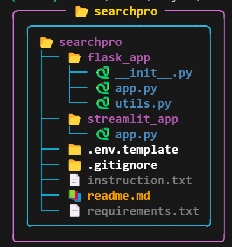

A fast way to search web - *powered by LLM*

## Setup Instructions:

### Step-1: Clone this repository:
```bash
git clone https://github.com/AK3847/searchpro.git
cd searchpro
```

### Step-2 : Setup a virtual-environment:
#### Using `venv`:
```bash
python -m venv venv
env\Scripts\activate # on windows
source env/bin/activate # on linux
```
#### Using `conda`
```bash
conda create --name project_env python=3.8
conda activate project_env
```

### Step-3: Install requirements:
```bash
pip install -r requirements.txt
```

### Step-4: Create a `.env` file using the `.env.template` file provided in the repo.

### Step-5: Run the Flask Backend:
```bash
cd flask_app
python app.py
```

### Step-6: Run the Streamlit Frontend
```bash
cd streamlit_app
python app.py
```

### Step-7: Open the web-application:
- Open your browser and go to `http://localhost:8501`.
- Search your query by entering it in the search-box

## Project Structure:
<p align="center">
    
</p>